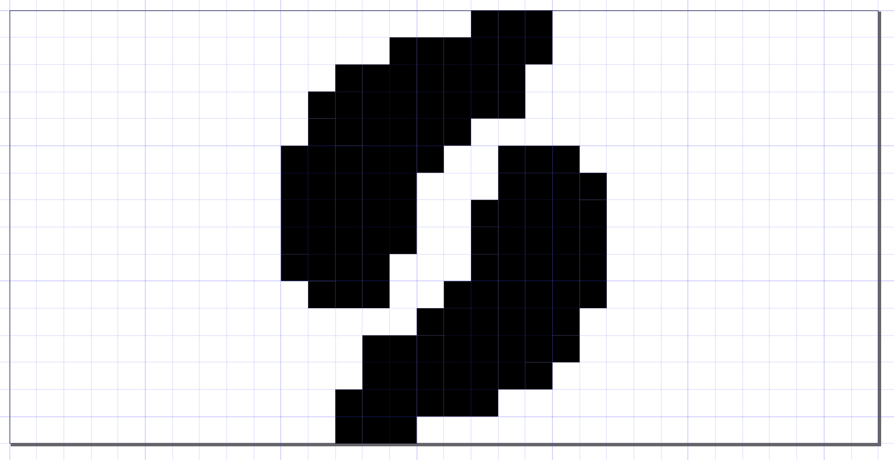

# Overview
Synergy One Ticker is a desktop digital art piece that displays mortgage backed security metrics on
an LED matrix. It is powered by an internet-connected Raspberry Pi Zero W and a 16x32 Adafruit LED matrix.
The system is driven by two separate software modules. First, a C++ program that scrolls an image across
the display using GPIO pins to communicate with the LED matrix. This software is built atop the
[rpi-rgb-led-matrix](https://github.com/hzeller/rpi-rgb-led-matrix) library.
Second, a Python controller program that downloads UMBS metrics and produces a text file for the C++ program to consume.

# Requirements

* Hardware
    * Raspberry Pi Zero W
    * Adafruit 16 x 32 LED Matrix
* Software
    * DietPi OS
    * Python 3.5+
    * C++ 17+
    * [rpi-rgb-led-matrix](https://github.com/hzeller/rpi-rgb-led-matrix)

# Build

Install RPI LED Matrix Library:

Clone the repository and follow the installation instructions.

```shell script
git clone https://github.com/hzeller/rpi-rgb-led-matrix.git
cd rpi-rgb-led-matrix
make
``` 

Install Synergy One Ticker:

```shell script
git clone https://github.com/ebarlas/synergy-one-ticker.git
cd synergy-one-ticker
make RGB_LIB_DISTRIBUTION=../rpi-rgb-led-matrix
```

### Linux Services

Install the app as a service using the steps in the raspberrypi.org systemd [reference document](https://www.raspberrypi.org/documentation/linux/usage/systemd.md).
The `coupons.sh` and `coupons.service` files are included as a convenience.

```shell script
cp coupons.service /etc/systemd/system/
```

```shell script 
systemctl start coupons.service
```

```shell script
systemctl enable coupons.service
```

### Synergy One Art

Below is a simplified Synergy One logo in the Inkscape design studio and the LED matrix.



